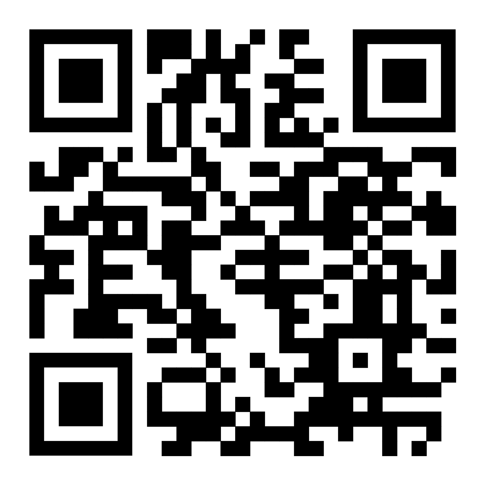

#  To Run this Project

## System Requirements
- Computer and a phone
- Internet connection
- A `.env` file ( see below)
- Run `npm` install on client
- Have JavaScript enabled ( react routing, etc)

## 🌱 Environment Variables (`.env`)
Create a `.env` file in the project root and add your own keys.

> ⚠️ **No real credentials are included in this public repository.**
> Use your own Supabase and PubNub accounts to run the project locally.

### Things to put in .env
<pre lang="markdown">
  VITE_SUPABASE_URL=your_supabase_url_here
  VITE_SUPABASE_ANON_KEY=your_public_anon_key_here

  VITE_PUBNUB_PUBLISH_KEY=your_pubnub_publish_key_here
  VITE_PUBNUB_SUBSCRIBE_KEY=your_pubnub_subscribe_key_here
</pre>

> You can duplicate from `.env.example`

## Steps to Start
1. Make sure you have the .env file
2. Run `npm install` on the client
3. Run `npm run dev` to start the localhost
4. If you want to test on a phone you can run `npm run --host` and go on the network link.

## 🔒 Access to Databases & PubNub (Security Notice)

For privacy and security reasons, the original project credentials
(Supabase, PubNub, authentication, etc.) **are not included**.

Feel free to email me or contact me via GitHub.

# 🌟 How to Explore the Abby Website

## 🧭 Step 1: Start at the Main Website
Visit the homepage to learn what Abby is all about.

- **Explore the “Get Close to Abby” section** to understand how you can join in the story.
- **Check out “Become Part of Abby”** to see how others are contributing to the space.

👉 [Visit the Main Website](https://get-close-to-abby.netlify.app/)

## 📝 Step 2: Submit Your Own Close-Up
People that visit the museum had the challenge to find where the close-up on their ticket fits into the Stadsliving spaces at Abby. This is the flow they would follow if they find it. They scan the QR code and unlock a reflection left by the original user who submitted the close-up image. They can then also submit their own close-up and reflection! IS FOR MOBILE ONLY

🔗 [Submit Your Close-Up](https://get-close-to-abby.netlify.app/open-call/get-close-to-abby/become-part-of-abby/found-it)

📱 Scan the QR code below to open the page on your phone:

## 💬 Step 3: Answer an Open Invitation
People can submit open invitations on site or on the website, they are then hanged in the Salon. People can then scan the QR to sign up to the open invitation and chat with other.

### Here is a list of Open invitation you can scan to simulate the experience

#### Visit the open invitation #5
📱 Scan the QR code below or click the link to see the open invitation 5.

🔗 [Closed Open Invitation link](https://get-close-to-abby.netlify.app/open-call/get-close-to-abby/become-part-of-abby/open-invitation/18399762-055d-497f-8adf-4746d127273f)

#### Visit the open invitation #19
📱 Scan the QR code below or click the link to see the open invitation 19.

🔗 [Closed Open Invitation link](https://get-close-to-abby.netlify.app/open-call/get-close-to-abby/become-part-of-abby/open-invitation/3f179ca2-03b3-4815-89ec-14513cbc6462)

#### Visit the open invitation #20
📱 Scan the QR code below or click the link to see the open invitation 20.

🔗 [Closed Open Invitation link](https://get-close-to-abby.netlify.app/open-call/get-close-to-abby/become-part-of-abby/open-invitation/5004cf29-3fd0-482e-9386-a31929a88c5e)

#### Fully Booked Open invitation
📱 Scan the QR code below or click the link to see what a fully booked open invitation looks like:

🔗 [Closed Open Invitation link](https://get-close-to-abby.netlify.app/open-call/get-close-to-abby/become-part-of-abby/open-invitation/b32d9b45-ad77-442a-b362-d0586860a007)

# Tech Stack
- **React Router v7** – file-based routing
- **TailwindCSS** – styling
- **Pubnub** – Chat
- **Vite** – build & dev server
- **Supabase** – database and storage (for image uploads)
- **Netlify** – deployment

# To see our process and more!

🔗 [MAIN FIGJAM (PROCESS)](https://www.figma.com/board/vT4THCcwrIsUxfunAO2sty/Integration4?node-id=5-2090&t=fijxxk9JtsaQkqTJ-1)

🔗 [DESIGN FIGMA (DESIGN)](https://www.figma.com/design/go55byDZ7C6wfbLYm2NrxB/ABBY?node-id=0-1&t=LyXHnSRbkaJyzfhZ-1)

🔗 [MICROSITE UX (UX PROCESS)](https://www.figma.com/proto/7oWCjH1Cf8q9FHsQV0CzcF/Microsite_team8_Integration4?page-id=50%3A2&node-id=50-4&viewport=160%2C146%2C0.1&t=9gCRO2jqtNg3ec3T-1&scaling=min-zoom&content-scaling=fixed&starting-point-node-id=50%3A4&show-proto-sidebar=1)

🔗 [GOOGLE DRIVE](https://drive.google.com/drive/folders/1WWujppiCrbbZv5MnVedbSnluSGUW8BEM?usp=drive_link)

