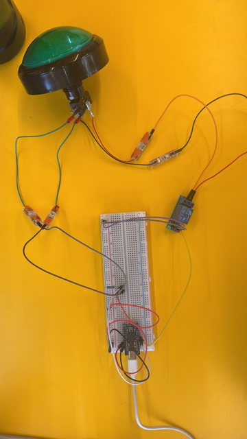

# To Run this Project
## System Requirement
- A Mac
- Internet to download the PDF on the website.
- USB connected printer
- The arduino button and connection we made plugged into your computer.

## Steps to Start
1. Make sure you have the .env file (see below what to put in)
2. Do the setup of the automator (seen below)
2. Run npm install on the client
3. Run npm run dev

## Things to put in .env
If you are too many, it might not work, but we tried with 2 people running the accounts and it was ok. Just be mindfull of that if you test all at the same time
<pre lang="markdown">
  VITE_SUPABASE_URL=your_supabase_url_here
  VITE_SUPABASE_ANON_KEY=your_public_anon_key_here
</pre>

## Instructions for the Printer Set-up:

How to setup automator on MacOS to auto-print (= automating an actual print command)

1. Open Automator on your Mac.
2. Choose New > Folder Action.
3. In the top bar: select your downloads folder
    Folder Action receives files and folders added to: "Choose your folder".
4. In the left sidebar, search for:
"Print Finder Items"
5. Drag that action to the workflow (right side).
6. Save it as something like: Auto Print Tickets.

✅ What this does:

Whenever a file is added to Downloads, Automator automatically sends it to the printer.

‼️ Limitations:
- You need to select your downloads folder in the Automator setup.
- Using a subfolder in your downloads folder will not work, as the browser does not allow you to choose or force a specific subfolder path to save files to (for security reasons).
- You need to have a default printer set up on your Mac for this to work.
- Test is done with USB connected printer, not network printer.

## Login info
If you want to access the databases, you can access them with these accounts.
### Supabase
Email: inge.ackerman@gmail.com

Password: R7JdZLX7EhRx66V!

## 🔒 Access to Databases (Security Notice)

For privacy and security reasons, the original project credentials (Supabase, PubNub, APIs) are not included in this public repository.

If you want to run the project locally:

* Create your own Supabase project
* Add the tables/structure as shown in the code
* Add your credentials in .env using the template above

Feel free to email me or contact me via GitHub.